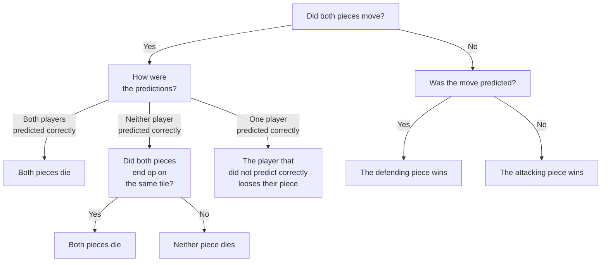

Prediction Chess - Physical Edition
-------

This document describes an alternative way of playing chess.
Instead of taking turns to move a piece, both players play at the same time.
They do this by first planning their move on a hidden board, and then when both players are ready revealing their move.
This mean you'll need 3 boards, 2 hidden ones and 1 normal board.

On top of planning their own move, players also predict the other player's move (again on their own hidden board).
Correct predictions will influence the outcome of a battle.
This means that when trying to take an opponent's piece, they might take your piece instead if they predicted your move.

# What you need

* 1 normal chessboard
* 2 travel-chessboards
    * Technically you can use any 2 additional boards, but travel-chessboards are easy to hold and hide for your opponent

<!-- TODO: Better image: -->

# Setup

* Place the normal chessboard in the center
    * This board will henceforth be called the **"main board"**
* Both player take one of the travel-chessboards in their hand
    * These boards will be called the **"secret boards"**
* All 3 boards are set up as a normal chess game

<!-- TODO: Image -->

# Taking a turn

A turn goes as follows (each step is explained in more detail below):

<!-- TODO: An icon for each step -->

1. **Hide**: Each players hides their secret board from the other player
2. **Plan**: Each player plans their own move
3. **Predict**: Each player predicts their opponent's move
4. **Move**: Both planned moves are executed on the main board at the same time
5. **Battle**: Battles are resolved
6. **Sync**: Both player sync up their hidden boards with the main board
7. **Repeat**

## Hide

First each player hides their board. Do this by holding it so your opponent cannot see the pieces you will move.

If you have travel-chess, you can simply hold the board up so your opponent can only see the back.

If you don't place something in the way to obscure the view for your opponent.

## Plan

To **plan** your own move you move one of **your own pieces** on your secret board.

## Predict

To **predict** an opponent's move you move one of **your opponent's pieces** on your own secret board.

## Move

Once both players are done, they reveal their secret boards to each other at the same time. Then both planned moves are executed. Do this by moving both pieces as planned to their destination tile. This might result in two pieces occupying the same tile, that is fine and we will handle that in the next step.

## Battle

There are two cases when a battle will take place:

1. Two pieces ended up on the **same tile**
2. Two pieces **swapped places** AND at least one of the moves was correctly predicted
    * So if neither player predicted the other player's move correctly no battle will take place

So either one, two or no battle take place each turn.

To resolve each battle, if any, follow this chart:

## Sync

Both players make sure their secret board matches the main board.

## Repeat

Repeat these steps starting by hiding your secret boards again.
