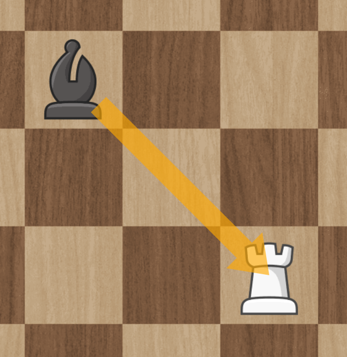
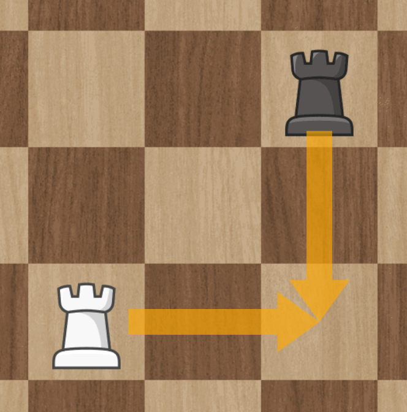
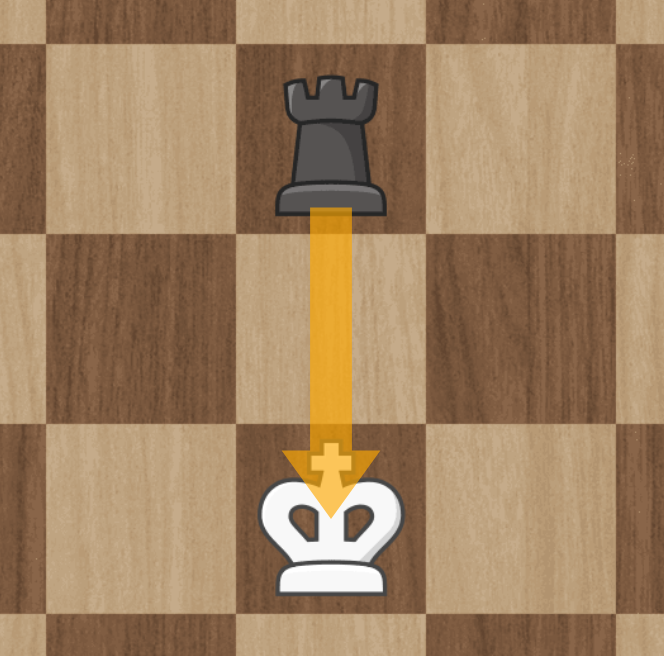
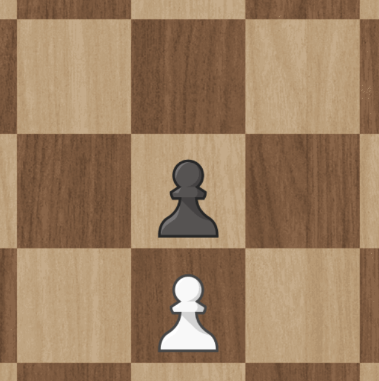
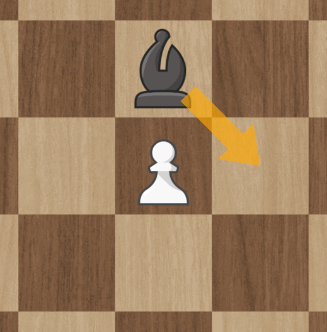
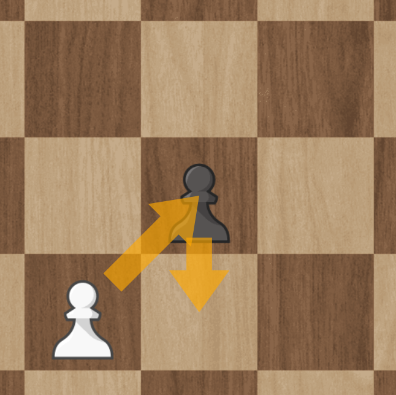
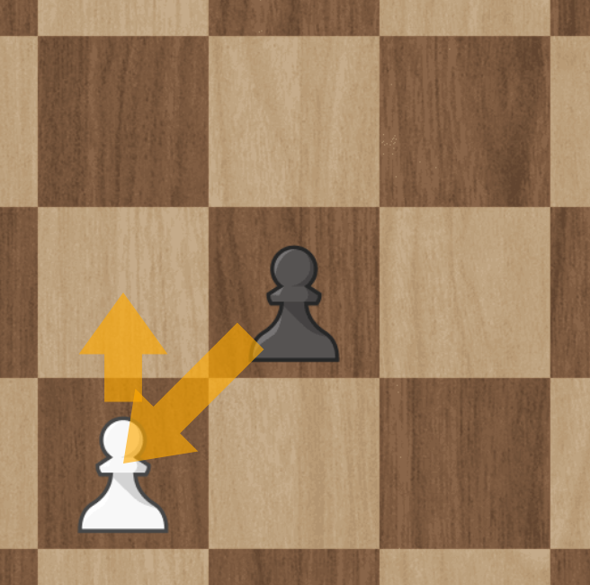
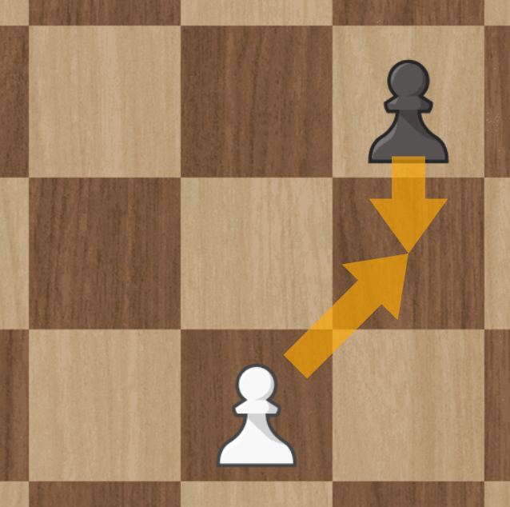

Prediction Chess - Physical Edition
-------

This document describes an alternative way of playing chess.
Instead of taking turns to move a piece, both players play at the same time.
They do this by first planning their move in secret (on a piece of paper for example),
and then, when both players are ready, revealing their move.

On top of planning their own move, players also predict the other player's move (again in secret).
Correct predictions will influence the outcome of a battle.
This means that when trying to take an opponent's piece, they might take your piece instead if they predicted your move.

# What you need

* A chessboard
* Pens and paper

# Setup

* Set up the chessboard as you would for a normal game
* Make sure both players can easily write down their move and prediction without the other seeing

# Taking a turn

A turn goes as follows:

<!-- TODO: An icon for each step -->

1. 📜 **Plan and predict**: Each player plans their own move, and predicts their opponent's
    * Do this by writing your move and prediction on your piece of paper
    * Make sure your opponent cannot see what you write down
    * You can plan and predict any legal chess move
        * Excluding castling
        * For pawns this gets a bit strange, see below for more information
2. 🎊 **Reveal**: At the same time, both players reveal their move and prediction
    * Do this by simultaneously placing your papers next to the board
3. 👣 **Move**: Both planned moves are executed on the main board at the same time
    * Do this by moving both pieces as planned to their destination tile
    * This might result in two pieces occupying the same tile, that is fine and we will handle that in the **battle** step
4. ⚔️ **Battle**: Resolve the battles
    * See below

If at any point the king is taken, that player looses.
Contrary to normal chess, you actually have to take the king,
rather than just getting a check mate.

For more details and examples see below.

## ⚔️ Battle

There are two cases when a battle will take place:

1. Two pieces ended up on the **same tile**
2. Two pieces **swapped places** AND at least one of the moves was correctly predicted
    * So if neither player predicted the other player's move correctly no battle will take place

As a result it's possible for either one, two or no battle take place each turn.

To decide which pieces die each battle follow this chart (see below for special rules for the king):

### Battling with the king

The king cannot fight, and thus always dies in a battle.
This means that even if you correctly predict an attack on your king,
your king looses that battle.

The only way to save your king, is by moving it out of the way so no battle happens.

When you kill your opponent's king, you win.
This is different from normal chess, where you just have to get a check mate.

### Avoiding battles

Instead of predicting an attack, you can also avoid an attack,
by moving your piece out of the way.

Remember, moves happen at the same time, so if your opponents moves to take your piece,
and you move that piece to a different spot, no battle happens.

As a reminder, since the king looses any battle they fight,
this is the only way of saving your king from an attack.

## Examples

(See next chapter for pawn specific examples, as they are extra complex)

### A normal battle

The black piece is attacking and the white piece does not not move:

Possible outcomes:

1. If white predicted the attack, the black piece dies.
2. If white **did not** predict the attack, the white piece dies.

### Swapping position

Both pieces are attacking each other,
as a result they swap positions:

Possible outcomes:

1. If **both** players predicted the attack: Both pieces die
2. If **neither** player predicted the attack: Neither piece dies
    * And thus they simply swapped position
3. If only white predicted correctly: The black piece dies
4. If only black predicted correctly: The white piece dies

### Avoiding an attack

One piece attacks,
but the other piece moves to a different position:

Even though black attacked, no battle takes place.
This is because white moved away,
so the pieces do not end up in the same position.

Predictions are irrelevant here, since no battle took place.

### A battle without an attack

Two pieces move to the same position:

Even though neither piece tried to attack,
a battle takes place since both pieces end up at the same position.

1. If **both** players predicted the attack: Both pieces die
2. If **neither** player predicted the attack: Again, both pieces die
3. If only white predicted correctly: The black piece dies
4. If only black predicted correctly: The white piece dies

### Attacking a king

Black attack the white king:

Remember, the king cannot fight.
So regardless of white's prediction,
the king dies, and black wins the game.

See the next example for an example of how to save your king.

### Saving your king

Black attacks the king, but white moves the king away.

Since the king moved away, no battle takes place.
This means the king is safe, and black does not win this turn.

### Tricking the king

White expects black to attack with their rook,
so white moves their king away to save it.
However, black actually moves their bishop to meet the king:

As a result, a battle happens between the king and bishop.
Since the king always looses in a battle, black wins the game.

Instead, white should have moved their king to a different position:

This way the king ends up in a safe position,
and black does not win this turn.

## Moving and attacking with pawns

### Basic move

Pawns can move as normal:

### Pawns battle without attack

When both pawns move to the same position:

A battle will take place, with the normal rules:

1. If **both** players predicted the attack: Both pawns die
2. If **neither** player predicted the attack: Again, both pawns die
3. If only white predicted correctly: The black pawn dies
4. If only black predicted correctly: The white pawn dies

### Stuck pawns

When two pawns are facing each other:

Neither pawn can move.

Even if the other piece is moving away,
the pawn cannot move this turn:

The pawn can only move the next turn,
when the position in front of it is empty.

### Pawns changing column

It is possible for a pawn to change column,
even without a battle happening:

Since in both cases the other piece moves away from the attack,
not battle takes place.
This means both pieces survive,
and the attacking piece change column without any battle happening.

### Pawns swapping position

Pawns can also both attack at the same time,
which results in them swapping position:

The battle is resolved with the normal rules for swapping position:

1. If **both** players predicted the attack: Both pieces die
2. If **neither** player predicted the attack: Neither piece dies
    * And thus they simply swapped position
3. If only white predicted correctly: The black piece dies
4. If only black predicted correctly: The white piece dies

### Illegal pawn move

The following move by white is **not** allowed:

Since there is no piece for white to attack,
white can only move forward, and not diagonally.

# House rules

The following are some good defaults for some common rules.
Consider these house rules, and you can change them if you want,
but let players know beforehand.

## Castling

Castling is not allowed.

## Promoting

As in normal chess, a pawn is promoted when it reaches to other side of the board.
You can promote to any piece you've lost.

Alternative: You can also always allow promotion to a queen,
but you'll need additional queen pieces for this.

## Moving two pawns one space

In some countries it's sometimes considered a legal move to move two pawns one space if neither has moved yet.
This is not considered a legal move here.
